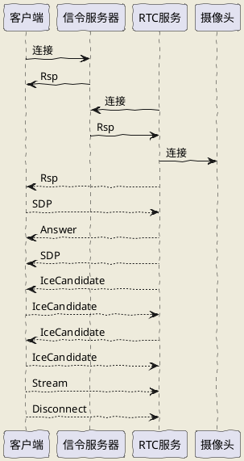

[toc]

## 多链路视频

无人机支持自组网链路和5G链路两种模式，在自组网或5G链路信号出现问题时可切换到另一种模式查看视频和控制无人机。（截止20230422需手动切换）

视频均采用WebRTC 方式，因自组网和5G链路的上传带宽不同，所以自组网上采用标准P2P模式，5G链路下采用推流/拉流模式，降低5G的上行带宽要求。

因此视频两个链路对应了两个独立的连接方式（截止20230422）。

## Demo


视频demo已将两种连接方式整合在一起，参见 [video_demo](video_demo)

## webrtc 协议

webrtc 协议采用websocket进行信令交互，消息内容采用json 编码。

视频源支持主附码流，并支持动态切换。

建议小窗口非全屏下使用附码流，降低带宽，提高视频的流畅度, 在点击视频全屏时发送Stream消息切换到主码流。


#### 信令交互流程



#### 路径

- url: wss://drone.godouav.com/rtc
- Query:
	- verify=user
	- password: 用户token


#### 消息定义

```json
{
    "from": "消息来源, 可不填充",
    "to": "消息目的地, 节点id",
    "cmd": "命令字",
    // 递增唯一序列号, 建议使用标准unix 时间戳，毫秒级
    "seq": 1,
    // 具体消息题
    "data": {}
}
```


#### 应答消息

- Cmd: "rsp"
- Body: 
```json
{
    // 错误码，0 无错误
    "code": 0,
    "msg": "错误信息"
}
```

#### 心跳消息

> websocket 心跳保持消息，建议60秒一次

- Cmd: "hb"
- Body:
```json
{
}
```


#### SDP 消息

- Cmd: "sdp"
- Body:
```json
{
    // 唯一标识, 可用uuid， 重复sesion将被拒绝
    "session": "会话标识",
    "camera": "camera id",
	"streamType" "main/sub, 主辅玛流",
    "sdp": "base64 编码后的sdp消息"
}
```

#### Answer 消息

- Cmd: "answer"
- Body:
```json
{
    // 错误码: 0 无错误
    "code": 0,
    "session": "会话id"
}
```

#### ICECandidate 消息

- Cmd: "icecandidate"
- Body:
```json
{
    "session": "会话id",
    "camera": "camera id",
    "candidate": "base64 编码后的ice candidate消息"
}
```

#### 切换码流消息

- Cmd: "stream"
- Body:
```json
{
	"cameraId": "摄像头id",
	"session": "回话id",
	"streamType": "main/sub, 主玛流/辅玛流"
}
```


## 录像文件路径

1.调用QueryVideoRecord 接口 获取全部相关录像文件列表  
* 旧版视频自组网和5g视频记录为一条  
* 新版视频录像改为：一个视频文件一条记录

2.增加参数说明

* videoType: 视频类型（0普通视频  1 AI视频）
* storeType: 文件存储类型（0老版视频存储类型、1自组网本地路径、2自组网云端地址、3云端绝对路径、4云端相对路径）

其中1、2、3、4无需区分自组网和5g

3.相关接口

自定义方法（如getProxyRealUrl（fileName,token））发送get请求：  

url: https://drone.godouav.com/api/backend/videorecord/generate/visitUrl?fileName=\${fileName}&access_token=${token}  

返回参数：真实的文件地址  

4.具体使用

视频文件路径为playPath参数  

* storeType==0:（兼容历史录像文件）  
a.自组网视频：

判断filePath是否为http开头，如果是的话直接取用filePath作为视频路径；不包含则取出nodeId(109)和fileName(static/AAA.mp4)进行路径拼接(如：https://drone.godouav.com/record/192.168.109.151/static/AAA.mp4）
b.5g视频：判断playPath是否为http开头，如果是的话直接使用


* storeType==1  
直接取出playPath，拼接域名https://drone.godouav.com+playPath

* storeType==2  
取出playPath，作为参数fileName通过方法getProxyRealUrl获取	云端真实路径作为视频文件路径

* storeType==3  
直接取出playPath使用

* storeType==4  
取出playPath，作为参数fileName通过方法getProxyRealUrl获取	云端真实路径作为视频文件路径

